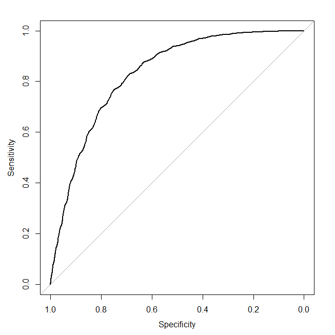

Kaggle上面的一个例子

# kattle_Predict_rain_using_Logistic_Regression
使用逻辑回归 预测西雅图的降雨情况

[阅读原文](https://www.kaggle.com/anudeepbommireddy/predict-rain-using-logistic-regression/code)

除了咖啡、垃圾食品和科技公司，西雅图最出名的就是经常下雨。这个数据集包含了从1948年1月1日到2017年12月12日的每日降雨模式的完整记录。  
数据集信息  
DATE:日期  
PRCP:降水量，单位为英寸  
TMAX:最高温度    
TMIN:最低温度   
RAIN:是否下雨  

#### 读取数据
```r
sw <- read.csv("C:\\Users\\pactera\\Desktop\\seattleWeather_1948-2017.csv")
```
#### 检查数据维度 查看一共多少行 多少列
```r
dim(sw)
```
#### 移除RAIN为空的列
```r
sw1 <- sw[-c(which(is.na(sw$RAIN))),]
dim(sw1)
```
#### 构建回归模型  RAIN随TMAX+TMIN变化而变化  
```r
lrmodel <- glm(RAIN~TMAX+TMIN, family = binomial, data=sw1)
summary(lrmodel)
```

```r
#install.packages("caret")  
library(caret)  
#cat 相当于print  
cat("Variable_Importance:")  
#计算变量的重要性  
varImp(lrmodel)  

#type 选择预测之后的输出结果，这个参数能用在binomial数据，也就是响应变量是二分型的时候，  
#这个参数选成type＝response，表示输出结果预测响应变量为1的概率。就是下雨的概率  
predicted_values <- predict(lrmodel, type="response")  
cat("Predicted_Values:\n")  
predicted_values[1:10]  

#阈值  
threshold=0.5  
cat("Threshold_Value:")  
threshold  

#预测结果概率大于0.5定为会下雨  小于0.5定为不会下雨  
predicted_class <- ifelse(predict(lrmodel, type="response")>threshold,TRUE,FALSE)  
cat("Predicted_Class:\n")  
predicted_class[1:10]  

#实际降雨情况  
actual_values <- lrmodel$y  
cat("Actual_Values:\n")
actual_values[1:10]

conf_matrix <- table(predicted_class,actual_values)
cat("Confusion_Matrix:\n")
conf_matrix

#预测与实际直接的比对  
conf_matrix
              actual_values
predicted_class     0     1
          FALSE 11424  3140
          TRUE   3224  7760

#accuracy准确性
accuracy <- (conf_matrix[1,1]+conf_matrix[2,2])/(sum(conf_matrix)) #正确预测结果/总的预测结果
cat("Accuracy_of_the_Model:")
accuracy

#灵敏度
sensi <- (conf_matrix[1,1])/(conf_matrix[1,1]+conf_matrix[1,2])
cat("Sensitivity:")
sensi

#特异性
speci <- (conf_matrix[2,2])/(conf_matrix[2,1]+conf_matrix[2,2])
cat("Specificity:")
speci

#install.packages("pROC")
library(pROC)
#roc 这是pROC包的主要功能。 它建立一个ROC曲线并返回一个“roc”对象，一个“roc”类的列表。 
#这个对象可以打印，绘图或传递给函数auc，ci，smooth.roc和coords。 此外，可以将两个roc对象与roc.test进行比较  
roccurve <- roc(actual_values, predicted_values)
plot(roccurve)
</img>  
#auc 该功能用梯形法则计算ROC曲线下面积（AUC）的数值。 
#有两种语法是可能的：roc函数中的类“roc”的一个对象，或者两个向量（响应，预测器）或公式（响应预测器）。   
#默认情况下，计算总AUC，但部分ROC曲线可以用partial.auc指定。  
auc(roccurve)  
```
